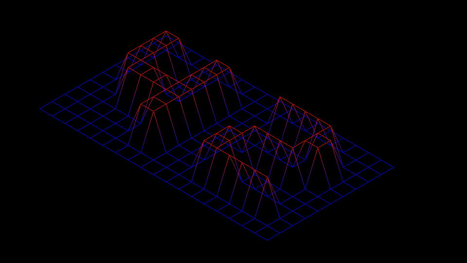

# FDF (Fil de Fer)



## Description

FDF is a 42 project that implements a 3D wireframe visualization of a grid, allowing users to explore and manipulate a 2D array of heights.

## Features

- 3D wireframe rendering of a height map
- Interactive controls for navigation and manipulation

## Installation

To compile and run the FDF project, follow these steps:

**1. Clone the repository:**

Run the following command in your terminal:

``` git clone https://github.com/jelloster/fdf.git ```

**2. Compile the project**

Run the following command in the repository:

``` make ```

**3. Run the program**

You can run the program with either one of the test maps in the "test_maps" folder, or make your own! (See section: Making your own map below)
Example:
``` ./fdf test_maps/42.fdf ```
## Controls

You can move the map around the window using **the arrow keys** and zoom in and out using **w** and **s**. **Esc** closes the program.

## Making your own map

Here are the requirements for your own map:
- The map has consistent row and column sizes
- The map file ends with ".fdf"
- Only numeric values are used.

Here is an example map (test_maps/42.fdf) as seen in the picture at the top of the README:

```
0  0  0  0  0  0  0  0  0  0  0  0  0  0  0  0  0  0  0 
0  0  0  0  0  0  0  0  0  0  0  0  0  0  0  0  0  0  0
0  0 10 10  0  0 10 10  0  0  0 10 10 10 10 10  0  0  0
0  0 10 10  0  0 10 10  0  0  0  0  0  0  0 10 10  0  0
0  0 10 10  0  0 10 10  0  0  0  0  0  0  0 10 10  0  0
0  0 10 10 10 10 10 10  0  0  0  0 10 10 10 10  0  0  0
0  0  0 10 10 10 10 10  0  0  0 10 10  0  0  0  0  0  0
0  0  0  0  0  0 10 10  0  0  0 10 10  0  0  0  0  0  0
0  0  0  0  0  0 10 10  0  0  0 10 10 10 10 10 10  0  0
0  0  0  0  0  0  0  0  0  0  0  0  0  0  0  0  0  0  0
0  0  0  0  0  0  0  0  0  0  0  0  0  0  0  0  0  0  0
```


